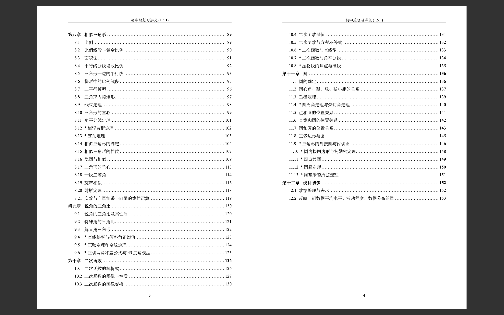

# ECNUThesis-Undergraduate

[](https://www.overleaf.com/latex/templates/ecnuthesis-latex-thesis-template-for-east-china-normal-university/szppdtkvgvpk)

### 初中数学总复习讲义

本模版使用 LaTeX3 重构了 [YijunYuan](https://github.com/YijunYuan) 的 [ECNU-Undergraduate-LaTeX](https://github.com/YijunYuan/ECNU-Undergraduate-LaTeX)，
用于编写上海初中数学总复习讲义。
当前版本号1.5.1。

### 内容
理论上包括二次根式、全等三角形、反比例函数、一次函数、代数方程、四边形、概率、相似三角形、锐角三角比、二次函数、圆以及专题内容。
覆盖上海市初二、初三数学全部内容。
但部分内容因时间关系完成度不够高，还需要进一步完善。

实际完成度如下：
- 一次函数 完成度50%，还需要细化一些例题。
- 四边形 完成度95%，只需要略微增加或删减题目。
- 相似三角形，完成度90%，预计再添加习题和瓜豆原理专题。
- 锐角三角比，完成度70%，还需要扩充专题并增加题目。
- 二次函数，完成度60%，还需要扩充专题并增加题目。
- 圆，完成度60%，还需要扩充专题并增加题目。
- 统计，完成度90%，只需要略微增删改部分表述。

### 编写风格
- 知识系统全面，细致严谨
- 注重知识与题目的关联
- 适度拓展
- 培养思维

## 使用环境

本模版只能使用 XeLaTeX 进行编译，使用其它 LaTeX 引擎将会导致编译失败。所以请安装最新版的 TeX Live ，并使用 XeLaTeX 进行编译。

若您的个人计算机中仍安装了老旧的 CTeX 套装，请毫不犹豫地卸载它，并安装最新版的 TeX Live。

## 编译方法

假设 TeX 源文件为 `thesis.tex`，请在命令行中执行
```
latexmk -xelatex thesis
```
以编译。

## 使用方法

请移步 [Wiki](https://github.com/Koyamin/ECNUThesis-Undergraduate/wiki) 阅读相关文档。


## 参考

- Kunth D E. 的 The TeXBook: Computers & Typesetting.
- CTEX.ORG 的 CTeX 宏集手册
- CTEX.ORG 的 xeCJK 宏包
- The LaTeX3 Project 的 The LaTeX3 Sources
- [stone-zeng](https://github.com/stone-zeng) 的 [fduthesis](https://github.com/stone-zeng/fduthesis)
- [YijunYuan](https://github.com/YijunYuan) 的 [ECNU-Undergraduate-LaTeX](https://github.com/YijunYuan/ECNU-Undergraduate-LaTeX)

## 软件许可证

华东师范大学校徽图案 (`inner-cover(contains_font).eps`) 版权归华东师范大学所有。

其他部分使用 LPPL 授权。
